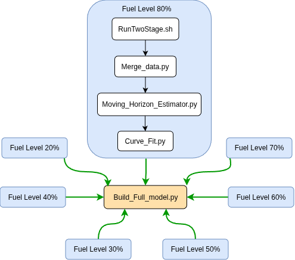

# Reduced-Order Slosh Estimation Model

This repository contains the workflow used to build a CFD-informed reduced-order slosh force model for a partially filled tank. The workflow starts with OpenFOAM slosh simulations, processes the CFD-derived force and center-of-mass data, estimates time-varying force coefficients using a Moving Horizon Estimator, fits those coefficients with analytical functions, and finally constructs a full parametric force model as a function of fuel level and time.

The goal of this workflow is to convert high-fidelity CFD slosh data into a compact reduced-order force model that can be evaluated efficiently without rerunning CFD.

---
---

## System Dependencies

This project uses OpenFOAM for the CFD simulations. Before running the workflow, make sure the system has the required C++, MPI, and scientific-computing dependencies installed.

### Fedora / RedHat

OpenFOAM requires a full C++ development environment, MPI support, and several scientific libraries.

Install the required packages with:

```bash
sudo dnf groupinstall "Development Tools"

sudo dnf install \
    gcc gcc-c++ make cmake \
    git \
    flex bison \
    zlib-devel \
    boost-devel \
    openmpi openmpi-devel \
    scotch scotch-devel \
    paraview \
    qt5-qtbase-devel qt5-qtsvg-devel qt5-qttools-devel \
    libXt-devel \
    gperftools-devel \
    fftw-devel
```
## Workflow Diagram



The comprehensive academic report, including detailed explanations and derivations, is available at the following location:

 docs/Final_Project_Report.pdf

---

## Workflow Summary

The workflow is repeated independently for each fuel level simulation.

For one fuel level, the process is:

    RunTwoStage.sh
          |
          v
    Merge_data.py
          |
          v
    CFD_data.dat
          |
          v
    Moving_Horizon_Estimator.py
          |
          v
    Estimator_results.npz
          |
          v
    Curve_Fit.py
          |
          v
    Analytical_force.json

This process is repeated for every fuel level case, for example:

    Fuel Level 20%
    Fuel Level 30%
    Fuel Level 40%
    Fuel Level 50%
    Fuel Level 60%
    Fuel Level 70%
    Fuel Level 80%

After all individual fuel level cases have been processed, the full model is built using:

    Build_Full_model.py
          |
          v
    curve_first_height_interpolated_surfaces.npz

The final output file contains the interpolated force-coefficient surfaces needed to evaluate the reduced-order slosh force model as a function of both time and fuel level.

---

## Main Scripts

### RunTwoStage.sh

`RunTwoStage.sh` runs the OpenFOAM slosh simulation using a two-stage simulation procedure.

The first stage corresponds to the forced-response portion of the simulation. During this part of the run, the lateral forcing or acceleration input is applied to the tank. Since this stage contains the strongest transient slosh response, the script uses a fine logging rate so that the wall-force response and liquid center-of-mass motion are captured with sufficient time resolution.

The second stage corresponds to the free-response portion of the simulation. In this regime, the forcing has been removed and the fluid motion gradually decays toward a slower steady-state response. Since the motion is slower during this stage, the script automatically changes the simulation settings and uses a slower logging rate to reduce the total output data size.

In summary, `RunTwoStage.sh`:

- Runs the OpenFOAM slosh simulation.
- Splits the simulation into two regimes:
  - Forced transient response.
  - Free-response decay toward steady state.
- Automatically changes the OpenFOAM simulation settings between the two regimes.
- Uses a fine logging rate during the forced-response regime.
- Uses a slower logging rate during the free-response regime.
- Produces the raw OpenFOAM post-processing output needed by the rest of the workflow.

The main OpenFOAM outputs used later in the workflow are the wall-force history and the liquid center-of-mass history.

---

### Merge_data.py

`Merge_data.py` post-processes the OpenFOAM output from the two-stage simulation.

Because the forced-response and free-response stages may use different logging rates, the raw OpenFOAM outputs must be merged into one continuous data file before the estimator can be run. This script reads the force data and the liquid center-of-mass data, combines the two simulation stages, aligns the signals in time, and writes one merged CFD data file.

This script generates:

    CFD_data.dat

`CFD_data.dat` is the main input file used by the Moving Horizon Estimator.

In summary, `Merge_data.py`:

- Reads the OpenFOAM wall-force output.
- Reads the liquid center-of-mass output.
- Merges the forced-response and free-response simulation stages.
- Aligns the force and center-of-mass signals in time.
- Generates one continuous CFD data file for the estimator.

---

### Moving_Horizon_Estimator.py

`Moving_Horizon_Estimator.py` performs the estimation step.

This script loads:

    CFD_data.dat

and uses a Moving Horizon Estimator to estimate the reduced-order slosh states and the time-varying force coefficients.

The reduced-order model represents the slosh response using modal states instead of the full CFD flow field. The estimator uses the CFD-derived center-of-mass motion and wall-force data to identify the internal model states and force-model parameters over time.

This script generates:

    Estimator_results.npz

This output file contains the estimated modal states and the estimated time-varying force coefficients for the current fuel level.

In summary, `Moving_Horizon_Estimator.py`:

- Loads the merged CFD data from `CFD_data.dat`.
- Runs the Moving Horizon Estimator.
- Estimates the reduced-order slosh modal states.
- Estimates the time-varying force coefficients.
- Saves the estimator output to `Estimator_results.npz`.

---

### Curve_Fit.py

`Curve_Fit.py` converts the estimated time-varying force coefficients into analytical functions.

This script loads:

    Estimator_results.npz

and fits analytical functions to the coefficient histories estimated by the Moving Horizon Estimator. This step is needed because the estimator produces discrete coefficient values in time, while the final reduced-order model requires smooth analytical functions that can be evaluated continuously.

This script generates:

    Analytical_force.json

`Analytical_force.json` contains the fitted analytical force-coefficient model for one fuel level.

In summary, `Curve_Fit.py`:

- Loads the estimator results from `Estimator_results.npz`.
- Extracts the estimated force-coefficient histories.
- Fits analytical functions to the estimated coefficients.
- Saves the fitted analytical model to `Analytical_force.json`.

This step must be repeated for every fuel level case.

---

### Build_Full_model.py

`Build_Full_model.py` builds the final parametric force model across all fuel levels.

After every fuel level has its own `Analytical_force.json` file, this script loads all of those files and constructs a full model that depends on both time and fuel height. The script combines the individual analytical fits and interpolates the force-coefficient behavior across fuel level.

This script generates:

    curve_first_height_interpolated_surfaces.npz

This file contains the full interpolated coefficient surfaces needed to evaluate the force model as a function of fuel level and time.

In summary, `Build_Full_model.py`:

- Loads the `Analytical_force.json` file from each fuel level.
- Combines the analytical force models from all fuel levels.
- Interpolates the force coefficients across fuel height.
- Builds the full time-and-fuel-level-dependent model.
- Saves the final model to `curve_first_height_interpolated_surfaces.npz`.

---

## Recommended Execution Procedure

Inside each fuel level simulation directory, run the following scripts in order:

    ./RunTwoStage.sh
    python3 Merge_data.py
    python3 Moving_Horizon_Estimator.py
    python3 Curve_Fit.py

After this sequence is complete, the current fuel level directory should contain:

    CFD_data.dat
    Estimator_results.npz
    Analytical_force.json

Repeat the same procedure for each fuel level simulation.

For example, repeat the workflow for:

    SIM_Slosh_20
    SIM_Slosh_30
    SIM_Slosh_40
    SIM_Slosh_50
    SIM_Slosh_60
    SIM_Slosh_70
    SIM_Slosh_80

Once all fuel level cases have been processed, run:

    python3 Build_Full_model.py

The final output will be:

    curve_first_height_interpolated_surfaces.npz

---

## Output File Summary

| File | Generated By | Description |
|---|---|---|
| `CFD_data.dat` | `Merge_data.py` | Merged CFD-derived force and center-of-mass data for one fuel level. |
| `Estimator_results.npz` | `Moving_Horizon_Estimator.py` | Estimated reduced-order states and time-varying force coefficients for one fuel level. |
| `Analytical_force.json` | `Curve_Fit.py` | Analytical time-function fits for the estimated force coefficients at one fuel level. |
| `curve_first_height_interpolated_surfaces.npz` | `Build_Full_model.py` | Final interpolated parametric force model across fuel level and time. |

---

## Complete Pipeline Description

The full modeling process is:

1. Run the OpenFOAM slosh simulation for a selected fuel level.
2. Use `RunTwoStage.sh` to run both the forced-response and free-response regimes.
3. Use `Merge_data.py` to merge the CFD output into `CFD_data.dat`.
4. Use `Moving_Horizon_Estimator.py` to estimate the reduced-order modal states and time-varying force coefficients.
5. Use `Curve_Fit.py` to fit analytical functions to the estimated force coefficients.
6. Repeat the same procedure for every fuel level.
7. Use `Build_Full_model.py` to combine all fuel-level analytical models.
8. Generate `curve_first_height_interpolated_surfaces.npz`, which contains the full parametric model.

The resulting model provides a compact CFD-informed representation of the slosh-induced force. Instead of running CFD every time the force response is needed, the final model can evaluate the force using analytical functions of time and fuel level.

---

## Final Model Output

The final model file is:

    curve_first_height_interpolated_surfaces.npz

This file contains the information needed to evaluate the reduced-order force model as a function of fuel level and time. It represents the final output of the complete CFD-to-estimator-to-analytical-model workflow.

---

## Notes

This workflow assumes that each fuel level simulation has been set up consistently and that the required OpenFOAM post-processing outputs are available before running the estimator.

Because Linux file names are case-sensitive, make sure the script names used in the commands match the actual file names in the repository. For example, `Curve_Fit.py`, `Build_Full_model.py`, and `Moving_Horizon_Estimator.py` must match the exact capitalization used in the repository.